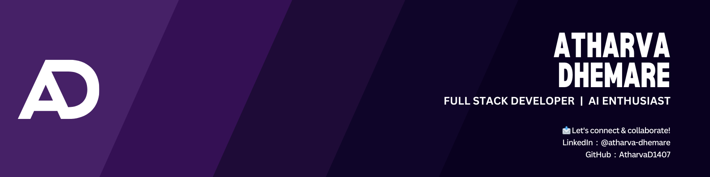

  

 

  
  
  
  
  
  

  
  
  

---

<h2 id="about-me"></h2>

I’m an aspiring full-stack developer, currently pursuing **MBA Tech** in **Computer Engineering** at **NMIMS Navi Mumbai**. I’m passionate about learning both front-end and back-end development, and I enjoy working on web development, competitive programming, and creating projects that challenge me.

I’m always looking to learn new technologies and contribute to open-source projects. My goal is to grow my skills and apply them to real-world projects that make a difference.

Feel free to check out my repositories, and don’t hesitate to reach out if you'd like to collaborate or discuss ideas!

---

<h2 id="tech-stack">💻 Tech Stack</h2>

---

<h2 id="github-stats">📊 GitHub Stats</h2>

<table style="border: none;" align="center">
  <tr>
    <td style="border: none;">
      
    </td>
    <td style="border: none;">
      
    </td>
  </tr>
</table>

  

---

<h2 align="center" id="coding-stats">LeetCode & Codeforces Stats</h2>

    
    

---

  

---

<h2 id="blog-posts">📝 Blog Posts</h2>

Check out my blog:
- **[Coding a skill for Everyone](https://medium.com/@Atharva_Dhemare/coding-a-skill-for-everyone-c4f19b2e2ed2)**: "🌟Coding is for everyone—learn, create, and solve problems to unlock endless opportunities!"

---

  

---

<h2 id="contact">📫 Connect with Me</h2>

---

<picture>
  <source media="(prefers-color-scheme: dark)" srcset="https://raw.githubusercontent.com/AtharvaD1407/AtharvaD1407/output/github-snake-dark.svg" />
  <source media="(prefers-color-scheme: light)" srcset="https://raw.githubusercontent.com/AtharvaD1407/AtharvaD1407/output/github-snake.svg" />
  
</picture>

---

